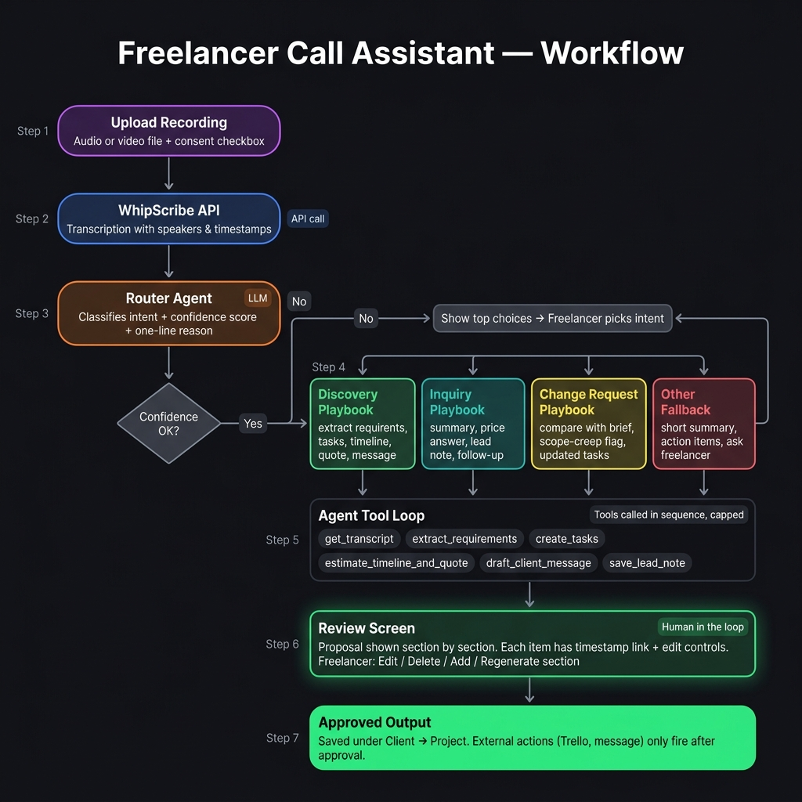
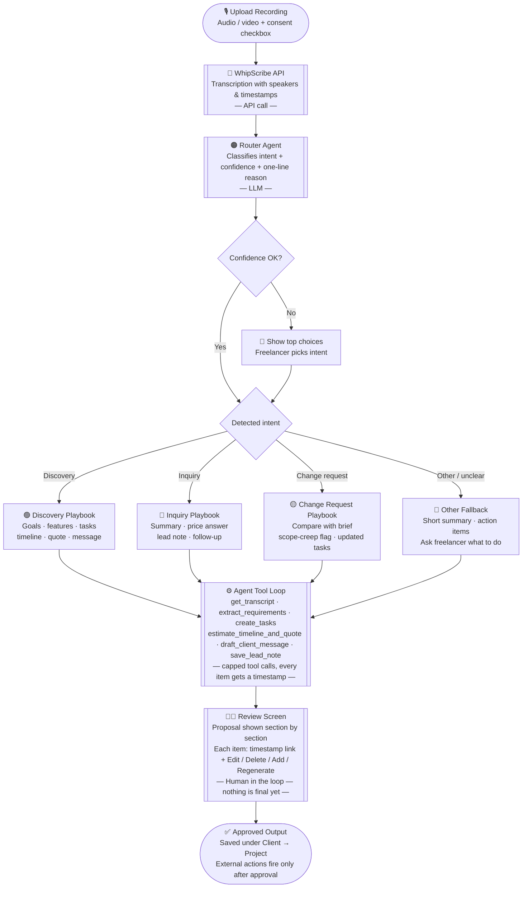

# Freelancer Call Assistant

**Track 4 — Invent a workflow** · WhipScribe Buildathon · Vijay Singh

A freelancer uploads a client call. An agent works out what kind of call it was, uses tools to produce the right output — brief, tasks, quote, reply message — and the freelancer reviews and edits everything before anything is saved or sent. Every item links to the moment in the recording it came from.

---

## The problem

**The person:** A freelance web developer taking calls with small-business clients — discovery calls, service inquiries, change requests, status checks.

**Their day today:**

- Client calls happen over WhatsApp voice or regular calls.
- Notes are written in a physical notebook during the call. WhatsApp chat is re-read after to find what the client actually asked for.
- Requirements are figured out by memory and rereading. Brief and quote are written manually from scratch.
- Gathering missing information, getting pricing right, following up before sending the quote — all done by hand, every time.
- There is no single record of what was agreed.

**The cost:**

- Hours of admin per call — notes, brief, quote, follow-up message.
- Requirements missed or misremembered.
- Scope creep with no evidence to refer back to.
- "You never said that" disputes at delivery — even sending a voice recording of the scope discussion didn't stop it.
- Slow quote turnaround loses leads.

**Why recordings are the way in:** the client's own words are the only source of truth that both sides agreed to at the time.

**Why not one fixed template:** a discovery call needs a full plan; a quick inquiry needs a short reply and a lead note; a change request needs a comparison with what was already agreed. A tool that does the same thing for every call is wrong for most of them.

---

## What a real freelancer told me

*I am the freelancer. These are my own answers, from working with clients for the past few years.*

**How the workflow works today:**
> "I contact clients through WhatsApp chat and voice calls — mostly WhatsApp chats. During the call I note points in a notebook. After the conversation I re-read the chat and find what the tasks are and what the client's requirement is, then I start working."

**The most painful part between call and quote:**
> - Turning messy call notes into a clear brief
> - Figuring out exactly what the client wants
> - Gathering missing information from the client
> - Creating the proposal and quote manually
> - Getting internal approval or pricing right
> - Following up with the client before the quote is even sent

**"You never said that" moments:**
> "Yes, many times. After I deliver the project the client says 'this is what I also told you.' I send them the voice recording about scope — and we still get into a dispute."

**What the tool should give after processing a call:**
> "A brief summarising what the client wants, a list of tasks and action items, and a draft message I can send to the client."

---

## Workflow





---

## How to run

> *This section will be filled in after Phase 1 is working.*

**Requirements:** Node.js 20+, a WhipScribe API key.

```bash
cd apps/vijay
cp .env.example .env
# Add your WHIPSCRIBE_API key to .env
npm install
npm run dev
```

---

## What works right now

- [ ] Phase 0: API docs read, exact response fields listed
- [ ] Phase 1: Upload → transcript with speakers and timestamps
- [ ] Phase 2: Discovery playbook — extraction, tasks, timeline, quote
- [ ] Phase 3: Review screen — edit, delete, add, redo, approve
- [ ] Phase 4: Router + inquiry playbook + other fallback
- [ ] Phase 5: Client memory + change-request playbook
- [ ] Phase 6: Polish + tested by 2–3 other freelancers
- [ ] Phase 8: Demo recording + full README + vision

---

## What does not work yet

Everything above that is unchecked. This README is honest about what is unfinished.

---

## Feedback from other freelancers

> *To be filled in after Phase 6 testing.*

| Person | How they handle calls today | What the agent got right | What they edited | Would they use it? |
|---|---|---|---|---|
| — | — | — | — | — |

---

## What I learned building this

> *To be filled in as I go.*

---

## What AI tools produced and what I kept or changed

> *To be filled in as I go. Example: "The agent extracted a task the client never mentioned. I added the timestamp-required guardrail because of this."*

---

## Vision

A year from now, if this works:

- **More call types:** status calls, feedback calls, payment follow-ups, onboarding calls.
- **More tools:** Notion, Trello, Linear, calendar, invoicing, WhatsApp — each as one small file added to the tool registry.
- **Learns your style:** keeps your past edits and uses them as examples, so outputs match your tone over time.
- **Client approval page:** client confirms the brief with one click — both sides signed off, disputes resolved before they start.
- **Scope-creep alerts** across the whole project history, not just one call.
- **Teams:** agencies sharing client history across developers.

**What I would need from WhipScribe to go further:**
- Webhooks when a transcript is ready (no polling)
- Richer speaker data — names where possible, not just Speaker 1 / Speaker 2
- Cross-library search so `get_client_history` can query all past calls for a client in one request
