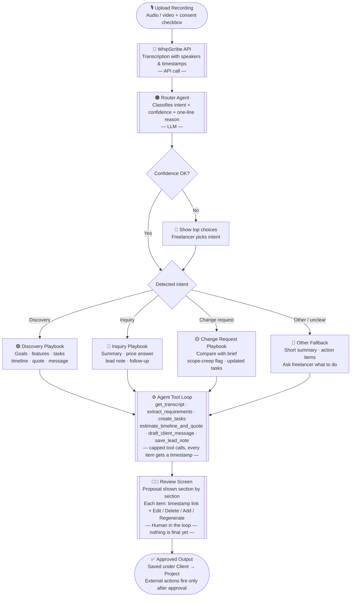

# Project Scope: Agentic Assistant for Freelancer–Client Calls

**Track:** WhipScribe Buildathon, Track 4 (Invent a workflow)
**Builder:** Vijay Singh
**Repo folder:** `apps/vijay/` in my fork of `whipscribe-buildathon`

> Rule for myself: build one call type fully end to end first. Add the next call type only after the previous one works. If something is not in section 5 "In scope", it waits until the MVP is tested by someone else.

---

## 1. One-line description

A freelancer uploads any client call. An agent works out what kind of call it was, uses tools to produce the right output (project brief, tasks, timeline, quote, reply message, change report), and the freelancer reviews and edits everything before it is saved or sent. Every item links to the moment in the recording it came from.

## 2. The user

A freelance web developer who takes many calls with small-business clients: first discovery calls, "do you do X and how much?" inquiries, change requests on running projects, status and feedback calls.

## 3. The problem

- **Today:** notes scattered across calls, briefs and quotes written by hand from memory, changes and promises forgotten, no history per client.
- **Cost:** hours of admin per call, missed requirements, scope creep, "you never said that" disputes, slow replies that lose leads.
- **Why not one fixed template:** every call is different. A first discovery call needs a full plan; a quick inquiry needs a short reply and a lead note; a change request needs a comparison with what was already agreed. A tool that does the same thing for every call is wrong for most of them.
- **Why recordings are the way in:** the client's own words are the source of truth.

## 4. Goal and success criteria

1. A real call goes from upload to a reviewed, usable output with no typing from scratch.
2. The agent picks the right kind of output for the call (and asks me when it is unsure).
3. Every item links to its timestamp and lands on the right moment.
4. The freelancer can edit, delete, add or regenerate any item; the agent never acts outside the app without approval.
5. At least 2 to 3 other freelancers have tried it and I have written down what they said.
6. A 2-minute demo shows at least two different call types handled differently.

## 5. Scope

### In scope (MVP)

**Input:** file upload of a call recording (audio or video), with a consent checkbox.

**Transcription:** WhipScribe API, with speakers and timestamps.

**Intent detection (router):** the agent classifies each call as one of:

| Intent | What it looks like | Output ("playbook") |
|---|---|---|
| First discovery call | New client describing their business and what they want | Client summary, goals, must-have and nice-to-have features, not-wanted list, open questions, task plan, timeline, quote range, confirm-with-client message |
| Simple service inquiry | "Do you build X? What does it cost?" | Short summary, rough price answer, lead note, follow-up message. No task plan. |
| Change request / follow-up on existing project | Client asks for changes or adds things | Comparison against the earlier brief, what is new or changed, scope-creep flag, updated tasks, timeline and price impact |
| Other / unclear | Anything else | Short summary and action items only, and ask me what to do |

Start with discovery and inquiry. Add change request third. "Other" is the fallback and is built from day one.

**Tools the agent can call (each is one small file):**

- `get_transcript` (transcript with speakers and timestamps)
- `get_client_history` (earlier calls and briefs for this client)
- `extract_requirements` (features, goals, not-wanted, open questions, each with timestamp)
- `create_tasks` (task list with S / M / L effort)
- `estimate_timeline_and_quote` (uses freelancer's own rate settings)
- `compare_with_previous_brief` (for change requests)
- `draft_client_message` (WhatsApp/email text)
- `save_lead_note`

**Human review (core feature):** the agent produces a *proposal*. The freelancer can edit any item, delete it, add one, or ask the agent to redo a section with an instruction ("make tasks smaller"). Nothing is final until approved.

**Client memory:** calls are grouped under a client and a project, so later calls can be compared with earlier ones.

**Settings:** the freelancer's hourly rate or per-task rates, currency, tone of messages.

**States:** designed loading, empty, error, low-confidence and done states.

### Out of scope for the MVP (goes into the vision)

- Live recording or bot joining calls
- Accounts, login, teams, payments
- More than four intents
- Real integrations beyond one (see stretch below)
- Mobile app
- Analytics dashboard

### Stretch (only after everything above works)

- One real integration as an example of the tool system, for example Trello or Notion, so approved tasks are created there. Proves that adding a tool is easy.
- Learning from edits: keep the freelancer's past edits and use them as examples so outputs match their style.
- Hindi/Hinglish call test.

## 6. How the agent works

1. Upload file, consent confirmed.
2. WhipScribe transcribes it.
3. **Router** reads the transcript (and client history if any) and returns an intent plus confidence and a one-line reason.
4. If confidence is low, the app shows the top choices and I pick the intent. Nothing runs blind.
5. The chosen **playbook** runs. A playbook is a small config: which tools it may use and what the output looks like.
6. The agent calls tools in a loop until the proposal is complete.
7. **Review screen:** proposal is shown section by section, each item with its timestamp link and edit controls.
8. Freelancer approves. Approved output is saved under the client and project. External actions (send message, create task in Trello) only happen after approval.

Why playbooks: adding a new call type or a new tool means adding one file, not rewriting the agent.

## 6a. Workflow diagram




## 7. Agent rules (guardrails)

- Never invent requirements: if the client did not say it, it does not go in.
- Every extracted item carries a timestamp. No timestamp, no item.
- Mark uncertain items so I can check them.
- No side effects without approval.
- Cap the number of tool calls per run so it cannot loop.
- Log each run (intent, tools called, result) so I can show how it works and debug it.

## 8. Data model (keep it small)

- `Client` (name, notes)
- `Project` (client, title, status)
- `Call` (project, file, transcript reference, detected intent, date)
- `Item` (call, type such as feature / task / question / quote / message, text, timestamp, status: proposed / edited / approved)
- `Settings` (rates, currency, tone)

Storage: SQLite. Enough for a prototype and no setup pain.

## 9. Tech plan

- **Language:** Node.js / TypeScript for server and web UI.
- **AI:** any LLM with tool calling. Write the agent loop by hand instead of using a large framework, so I understand every step (this is judged under "building with AI, well").
- **WhipScribe:** the API for transcription. Check whether the MCP server's search and ask tools can serve `get_client_history`. Only use what the docs confirm.
- **Secrets:** API keys in `.env`, never committed. Add `.env` to `.gitignore` first.

```
apps/vijay/
  README.md          problem page, how to run, what works, vision
  .env.example
  src/
    server/
      agent/         router, loop, guardrails
      playbooks/     discovery.ts, inquiry.ts, change-request.ts, other.ts
      tools/         one file per tool
      db/
    web/             upload, review screen, client view
  samples/           my test recordings and outputs
```

## 10. Build phases (in order)

| Phase | What | Done when |
|---|---|---|
| 0 | Read docs, get API key, list exact API fields | I know what the API really returns |
| 1 | Upload a recording, get transcript with speakers and timestamps | I can print them |
| 2 | Discovery playbook only, no router yet: extraction, tasks, timeline, quote with timestamps | Output is good enough to send to a client |
| 3 | Review screen: edit, delete, add, redo section, approve | A freelancer can fix a bad output without help |
| 4 | Router + inquiry playbook + "other" fallback | Two different calls give two different outputs |
| 5 | Client and project memory + change-request playbook | A follow-up call is compared with the earlier brief |
| 6 | Polish states, settings, test with 2 to 3 other freelancers | Their feedback is written down |
| 7 | Stretch: one integration and/or learning from edits | Only if phases 0 to 6 are solid |
| 8 | Demo recording, README, vision, open PR | All deliverables ticked |

Open the PR after phase 3, and keep it updated.

If time runs short: ship phases 0 to 4 well. Two call types handled properly, with a good review screen, beats four half-working ones.

## 11. Test material

I need sample calls of different types. Record role-played calls (with a friend, both agreeing):

- 1 or 2 first discovery calls (messy, real-sounding)
- 1 quick service inquiry
- 1 change-request call on a project already discussed
- 1 unclear/off-topic call to test the fallback

## 12. Deliverables checklist (what reviewers ask for)

- [ ] One-page problem statement, including what a real freelancer told me
- [ ] Workflow drawn (steps, tools, what the API does, what the user sees)
- [ ] Working prototype with real API calls, at least two call types end to end
- [ ] 2-minute recording of the workflow
- [ ] Vision: a year on, who else it serves, what I need from WhipScribe, what I build next
- [ ] README with how to run it and what works
- [ ] Notes on what AI tools produced and what I kept or dropped
- [ ] Notes on what was new to me
- [ ] Someone other than me tried it

## 13. Testing plan

Ask each freelancer who tries it:
1. How do you handle client requirements and quotes today?
2. Did the agent pick the right kind of output? Where was it wrong?
3. What did you edit, and why?
4. Would you use this on your next client call?

Write the answers in the README.

## 14. Risks

| Risk | What I do |
|---|---|
| Scope grows too big | Playbook by playbook; ship with two if needed |
| Wrong intent detected | Show confidence; ask me when unsure; allow manual override |
| Model invents things | Timestamp required for every item; empty beats made up |
| Agent loops or costs too much | Tool call cap; log every run |
| API doesn't return what I assumed | Read docs first; design around real fields |
| Recording without consent | Only my own or role-played calls; consent checkbox |
| Editing UI takes longer than expected | Start with simple inline edit, improve later |

## 15. Rules to remember

- My own WhipScribe account and my own recordings.
- Never record someone who did not agree.
- No keys, secrets or tokens in commits.
- Do not build on API behaviour the docs don't confirm.

## 16. Vision seeds (README, not for building now)

- More call types: status calls, feedback calls, payment follow-ups
- More tools: Notion, Trello, Linear, calendar, invoicing, WhatsApp
- Learns each freelancer's style from their edits
- Client approval page: client confirms the brief with one click
- Scope-creep alerts across the whole project history
- Agencies with several people sharing client history
- What I would need from WhipScribe: webhooks for finished transcripts, richer speaker data, cross-library search

## 17. Next action

Phase 0: read the API docs and write down the exact response fields I can rely on.